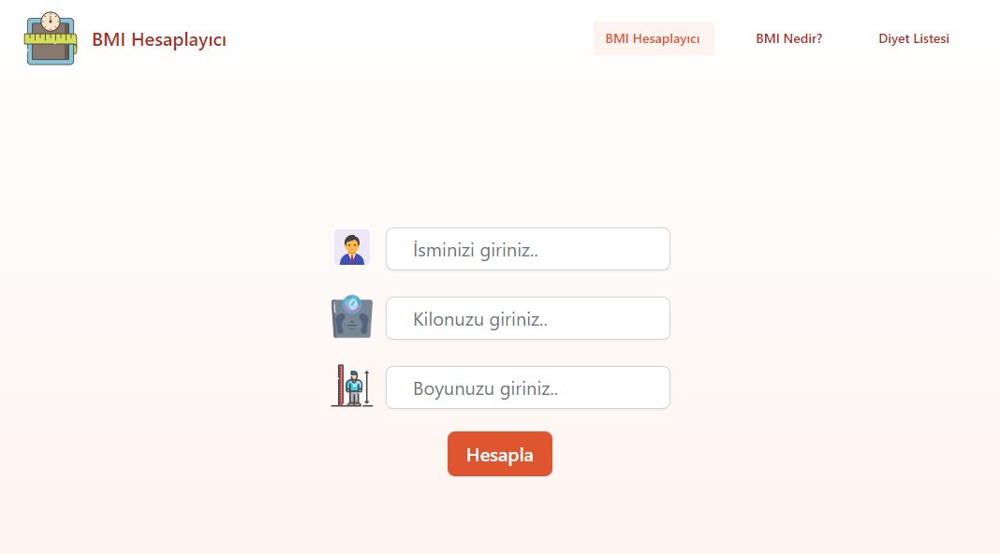
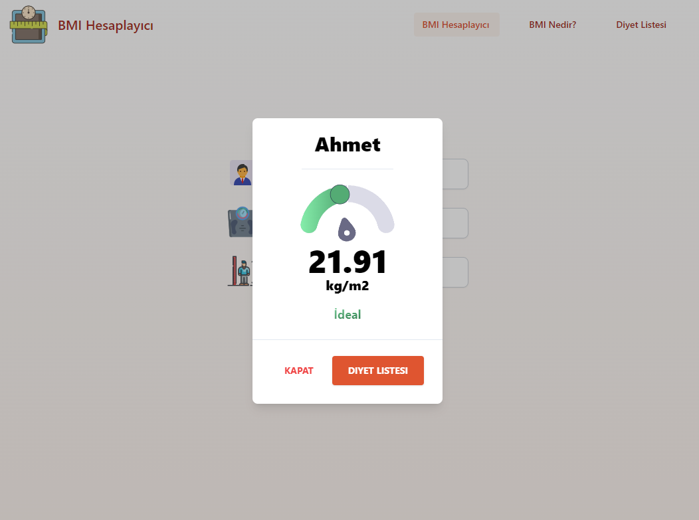
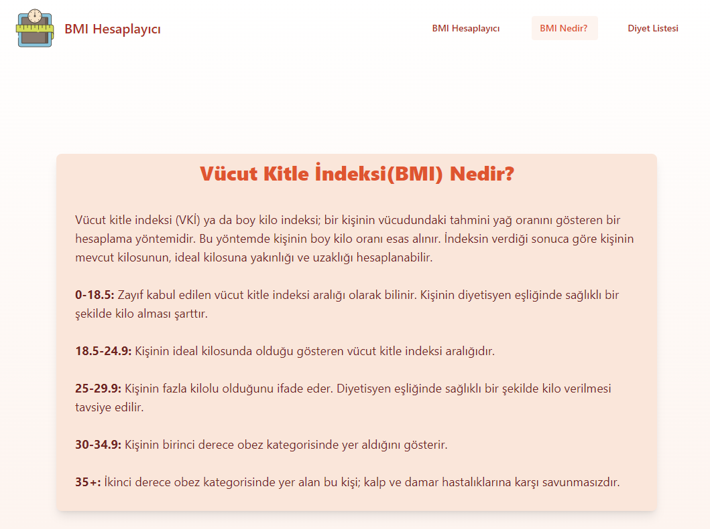
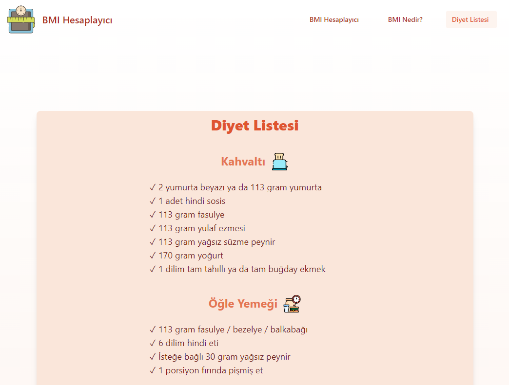

# React-BMI-Calc-App

Patika.dev Frontend Web Development Projeleri "Vücut Kitle Endeksi Hesaplama" çalışması.

https://bmi-calc-app-demo.netlify.app/

- `React.js` ve `Javascript`
- Stillendirmede `Tailwind CSS`
- react-router-dom
- localStorage

